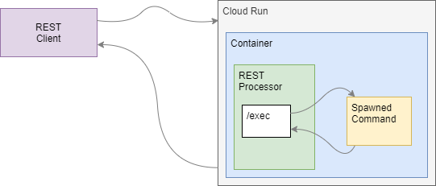

# shell-exec-cloud-run
Execute a shell command within Cloud Run.

This repository contains sample code for use in conjunction with the article on
debugging Cloud Run applications by running shell commands within a Cloud Run container.

